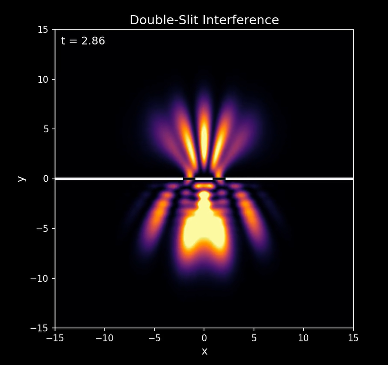

# Double Slit Simulation

This project simulates the famous **Double-Slit Experiment** using Python, NumPy, and Matplotlib.  
It shows how a Gaussian wave packet (representing a photon or electron) passes through two slits and produces an **interference pattern** on the screen.

## Requirements
- Python 3
- numpy
- matplotlib

## 🔬 Features
- Time-evolution of a quantum wave packet
- Double-slit barrier visualization
- Animated interference fringes
- Output video (`double_slit.mp4`)

## 📸 Preview
Here’s a short preview of the simulation:



## ▶ Watch the animation
you can [watch the video here](double_slit.mp4).  
Otherwise, download `double_slit.mp4` from this repo and play it locally.

## Run
```bash
python double_slit.py
```
## 📄 License
This project is licensed under the **MIT License** – see the [LICENSE](LICENSE.txt) file for details.
